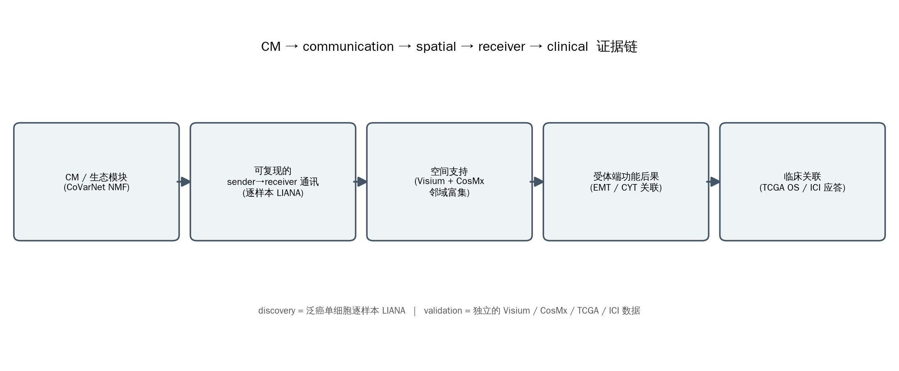
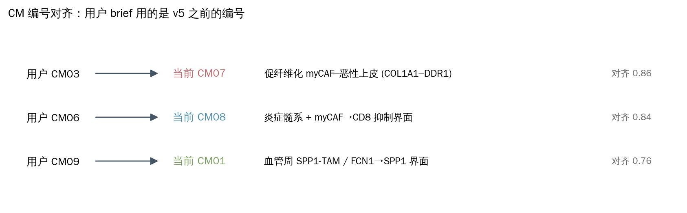
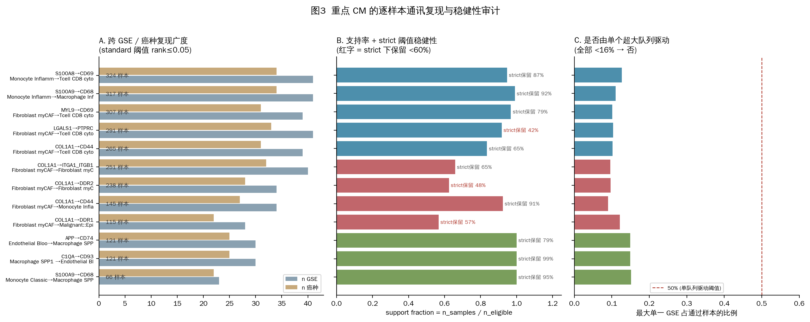
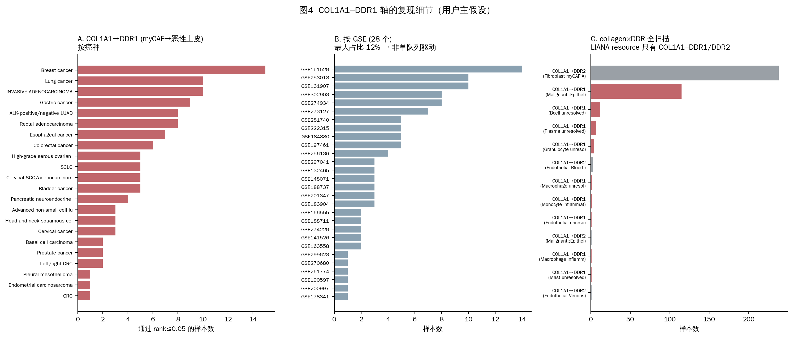
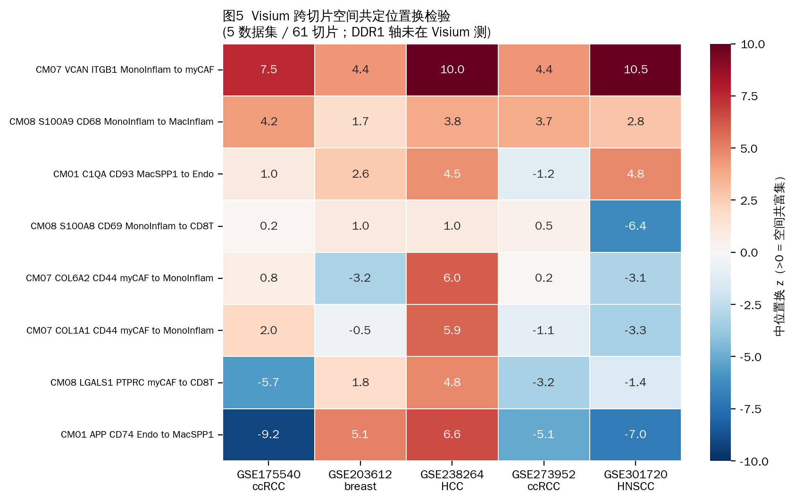
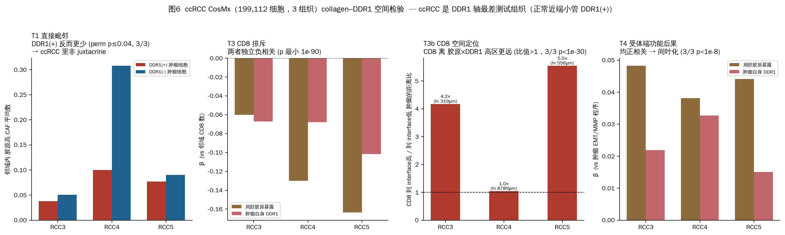
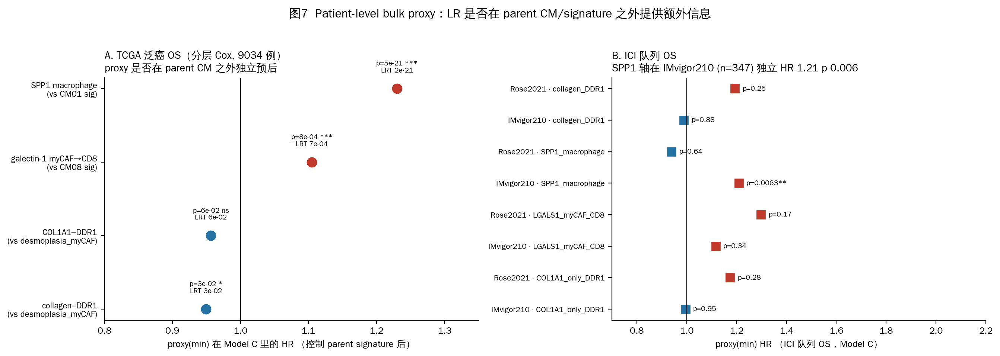
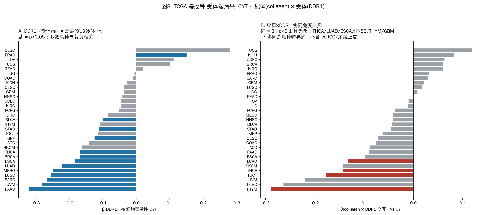
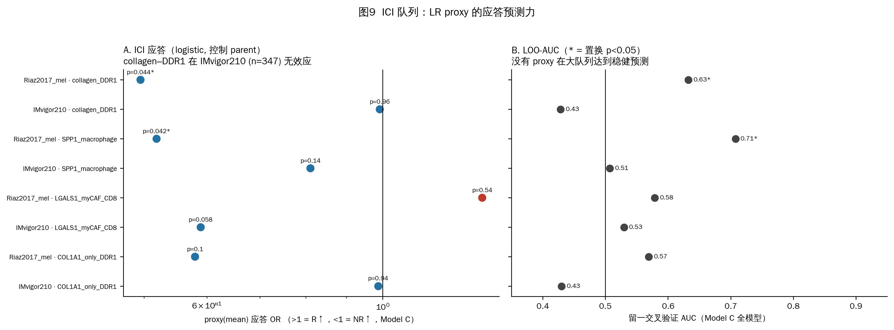
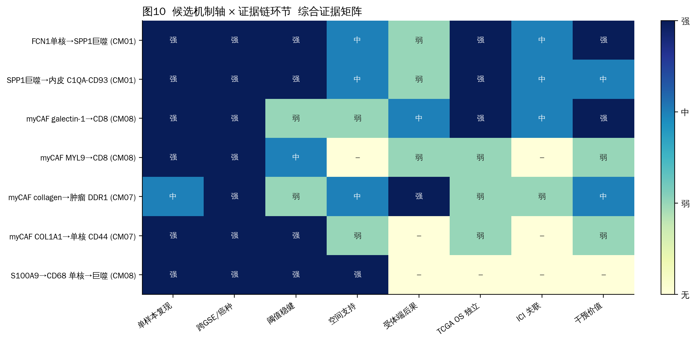

# CM 模块 → ligand–receptor 通讯 → 空间支持 → 受体端功能 → 临床关联
## 完整证据链：详细方法、结果与可视化

生成日期 2026-09-06 ｜ 工作目录 `communication_evidence_chain_20260906/`（全部新输出，**未覆盖任何 Phase B 结果**）
计算：本地 V100 机 ｜ 复用已完成的逐样本 LIANA、Visium 空间置换、TCGA toil、ICI bulk 队列——**未重跑数百万细胞**

本报告是对 `COMMUNICATION_EVIDENCE_CHAIN_CN.md` 的详细展开版，10 张图逐一解读。
数据表见 `tables/`，脚本见 `scripts/01..05`。

---

## 目录

- [0. 研究问题与设计](#0)
- [1. CM 编号对齐（关键前提）](#1)  — 图2
- [2. 审计：consensus 通讯是怎么从单样本 LIANA 汇总的](#2)  — 图1
- [3. 重点 CM 的逐样本通讯复现](#3)  — 图3、图4
- [4. 空间支持](#4)  — 图5（Visium）、图6（CosMx）
- [5. Patient-level bulk proxy 模型 A/B/C](#5)  — 图7
- [6. 受体端功能后果](#6)  — 图8
- [7. ICI 应答预测](#7)  — 图9
- [8. 综合证据矩阵](#8)  — 图10
- [9. 三个问题的回答](#9)
- [10. 局限性](#10)
- [11. 产物索引](#11)

---

## 0. 研究问题与设计

**用户核心疑问**：Phase B 只把整个 CM/TLS/desmoplasia gene signature 投射到 TCGA 和 ICI bulk，
没有系统利用逐样本 LIANA 已经定位到的具体 ligand–receptor interaction。需要建立：

> CM / ecological module → reproducible sender–receiver communication → spatial support
> → receiver functional consequence → clinical response/survival association

**并且**：不是用 LR 替代 CM，而是判断 **LR 是否在 parent CM 之外提供额外信息**；
discovery 与 validation 分开；不为得到显著结果反复调阈值。

**设计**（图1）：

- **Discovery**：泛癌单细胞逐样本 LIANA（已完成，1301 样本 / 54 GSE / 43 癌种）——**复用，不重跑**。
- **Validation**（相互独立的数据）：
  - 空间：Visium 5 数据集 61 切片（复用置换表）+ ccRCC CosMx 199,112 细胞（新做邻域分析）
  - 临床：TCGA toil 泛癌 9034 例（OS/PFI，分层 Cox）+ 5 个 ICI bulk 队列（应答 + OS/PFS）
- 每条候选 axis 建立**逐样本表**（不只 pooled），评估跨 GSE / 癌种复现、单队列杠杆、阈值稳健性。

---

## 1. CM 编号对齐（关键前提）

用户 brief 里的 **CM03 / CM06 / CM09 是 v5 之前的 NMF 编号**。当前冻结契约
（`final_annotation_v6_identity_v5_malignancy_v3`，20260825 版 CoVarNet，K=9）编号完全不同。
按 `frozen/reports/V5_CM_IMMUNE_COMMUNICATION_COMPARISON_CN.md` 的旧→新一对一对齐
（共享样本活动 Spearman 65% + top-10 主要谱系组成余弦 35%）：

| 用户说的 | = 当前 CM | 对齐分 | 本质 |
|---|---|---|---|
| **CM03**（myCAF→malignant，COL1A1–DDR1）| **CM07** | 0.86 (strong) | 促纤维化 myCAF–恶性上皮结构性通讯 |
| **CM06**（myCAF→T / myeloid）| **CM08** | 0.84 (strong) | 炎症单核/巨噬 + myCAF→CD8 抑制界面 |
| **CM09**（FCN1 monocyte→SPP1 macrophage→cytotoxic T/NK）| **CM01** | 0.76 (strong) | 血管周 SPP1-TAM / FCN1→SPP1 髓系–内皮界面 |

> ⚠️ **当前 CM03** 是"严格恶性分数"冷肿瘤模块（strict malignant fraction ρ=0.70，immune-hot proxy ρ=−0.45），
> top-10 成员**没有 myCAF**，且"没有通过研究级过滤的非背景跨细胞关系"。
> 用户记忆里的"CM03 myCAF→malignant"确实存在——它在当前契约里叫 **CM07**。
> 本报告下文一律用**当前编号**。

---

## 2. 审计：consensus 通讯是怎么从单样本 LIANA 汇总的

冻结 LIANA run：`Project_v3/runs/.../20260825_v5_final_v1/`（脚本 `07_run_liana_per_sample_cm.py`、`08_build_figures_and_report.py`）

### 2.1 逐样本 LIANA（脚本 07）

| 项 | 设置 |
|---|---|
| 单位 | **每个原始样本独立**跑 `liana.mt.rank_aggregate`（RRA 聚合，resource=`consensus`）|
| 表达输入 | counts → 样本内 `normalize_total(1e4)` → `log1p` |
| 分组 | `final_annotation_with_malignancy_v6`（细分细胞状态），每组 **≥20 细胞**才纳入 |
| 表达门槛 | `expr_prop=0.10`：配体在发送组 ≥10% 细胞、受体在接收组 ≥10% 细胞表达 |
| 随机种子 | 1337 |
| **within-CM 过滤** | 只保留 source 和 target **同时**是某个 CM 的 CoVarNet top-10 成员的互作，打 `shared_cm` 标签 |
| 结果 | 1322 样本，**1301 成功**，21 因 <2 组跳过；聚合表 1121 万行（样本 × 有序 (source,target) × LR × 方向）|

### 2.2 consensus 汇总（脚本 08 `build_communication`）

1. **事件过滤**：逐样本逐 LR 逐方向，保留 `magnitude_rank ≤ 0.05 且 specificity_rank ≤ 0.05`
   → **38.2 万** "rank05 事件"（`communication_rank05_events.tsv.gz`）
   - `magnitude_rank` = 配体×受体表达强度的跨互作秩（小 = 表达强）
   - `specificity_rank` = 该 (source,target) 对相对其他细胞对的特异性秩（小 = 特异）
2. 按 `shared_cm` 展开成单 `cm`
3. 按 **(cm, source, target, ligand_complex, receptor_complex)** 分组统计：
   - `n_samples` / `n_gse` / `n_cancer_types` = 去重计数（**复现广度**）
   - `mean_magnitude_rank` / `mean_specificity_rank` / `mean_lr_means` / `mean_lrscore` = 对**通过过滤的样本**取均值
   - `replicate_rank_score = log1p(n_samples) × −log10( sqrt(mean_mag_rank × mean_spec_rank) )`
   → **29 605 条 consensus**（`communication_consensus_global.tsv.gz`）
4. `communication_research_priorities.tsv`（139 条）再加：
   - **可检验分母** `n_eligible_samples` = source 和 target 两组都 ≥20 细胞的样本数
   - `support_fraction = n_samples / n_eligible_samples` + Wilson 95% CI
   - `mechanism_class`、`research_priority_score`；剔除自通讯、复核端点、B2M–KLRD/KLRC 背景轴；
     要求 ≥10 可检验样本、≥3 GSE、≥3 癌种

**口径限制（原作者已声明，本报告沿用）**：consensus 的 n_samples/n_gse/n_cancer 是**复现广度**证据，
**不是**因果通讯；比较单位必须是样本，不能用 pooled-cell P 值替代生物学重复。

---

## 3. 重点 CM 的逐样本通讯复现

方法（`01_audit_and_samplelevel.py`）：从 `all_within_cm_interactions.tsv.gz` 流式抽出每条目标 axis 的
**全部逐样本行**（不只 rank≤0.05 的），建立 `focus_axes_sample_level.tsv.gz`；分母 = source 与 target
两个细胞状态都在该样本出现过的样本集。三档阈值：strict (rank≤0.01)、standard (≤0.05)、loose (≤0.10)。

### 3.1 复现广度、稳健性、单队列杠杆（图3）

- **面板 A**：所有 12 条目标 axis 都跨 ≥23 GSE / ≥22 癌种复现——广度不是问题。
- **面板 B**（关键）：`support fraction`（通过样本 / 可检验样本）+ strict 阈值稳健性。
  **红字 = strict (rank≤0.01) 下只保留 <60% 的 standard 样本**：
  - `COL1A1→DDR1 myCAF→恶性上皮`（CM07）：strict 保留 **57%** —— **CM07 里最不稳健的一条**
  - `COL1A1→DDR2 myCAF autocrine`（CM07）：48%
  - `LGALS1→PTPRC myCAF→CD8T`（CM08）：42% —— PTPRC 是泛免疫标记，特异性弱
  - 对比：`S100A9→CD68`（0.92）、`C1QA→CD93`（0.99）、`COL1A1→CD44 myCAF→单核`（0.91）、
    `FCN1→SPP1 S100A9→CD68`（0.95）都很稳
- **面板 C**：最大单一 GSE 占通过样本的比例——**全部 <16%**，没有任何一条是单个超大队列驱动的。

### 3.2 COL1A1–DDR1 轴细节（用户主假设，图4）

- **面板 A**：`COL1A1→DDR1 myCAF→恶性上皮` 在 **22 个癌种**都被检出——乳腺（15 样本）、
  肺（多个 GSE 共 20+）、胃、CRC、卵巢、食管、膀胱、HNSCC、间皮、BCC、panNET…
- **面板 B**：跨 **28 个 GSE**，最大占比 12%（GSE161529 乳腺）→ 非单队列驱动。
  specificity_rank 中位 6e-6（一旦检出就高度细胞类型特异）；magnitude_rank 中位 ~0.01
  （胶原表达高、肿瘤 DDR1 表达偏低，处于 magnitude 边界——这解释了面板 B 的 strict 不稳）。
- **面板 C**：collagen×DDR 全扫描——**LIANA consensus resource 里 DDR1 只和 COL1A1 配对**
  （没有 COL1A2/COL3A1→DDR1）。所以"collagen–DDR1"在单细胞层面 = **COL1A1–DDR1**。
  COL1A1→DDR2 主要是 myCAF autocrine（238 样本）。

**小结**：COL1A1–DDR1 轴确实**广泛且特异地复现**，但它是所有 CM07 跨细胞轴里**表达强度最弱、
阈值最不稳健**的一条。

---

## 4. 空间支持

### 4.1 Visium 跨切片置换（复用，5 数据集 61 切片，图5）

`spatial_expansion_20260903/runs/20260904_all_visium_cm_region_communication_v1/`。
置换 z>0 = 配体-发送态活动与受体-接收态活动在空间邻域**共富集**（k 近邻，999 次置换）。

| axis | 5 数据集 z>0 数 | 判断 |
|---|---|---|
| VCAN→ITGB1  单核↔myCAF (CM07) | 5/5，中位 z 4.4–10.5 | **强、泛癌一致** |
| S100A9→CD68  单核→巨噬 (CM08) | 5/5 | **一致** |
| C1QA→CD93  SPP1巨噬→内皮 (CM01) | 4/5 | 基本一致 |
| COL1A1→CD44  myCAF→单核 (CM07) | 2/5（HCC + 1 ccRCC 阳；乳腺/HNSCC/另一 ccRCC 阴）| **混杂** |
| LGALS1→PTPRC  myCAF→CD8T (CM08) | 2/5（HCC + 乳腺阳；2 ccRCC + HNSCC 阴）| **混杂——与"排斥"相符（抑制 = 不共定位）** |
| APP→CD74  内皮→SPP1巨噬 (CM01) | 2/5 | 方向不稳 |

> ⚠️ **Visium run 没有测 DDR1 轴**——COL1A1–DDR1 的空间证据只有下面的 CosMx。

### 4.2 ccRCC CosMx 邻域分析（新做，图6）

数据：Manley lab（Zenodo 12730227），3 组织 RCC3/4/5，**199,112 细胞**，978 基因 CosMx IO panel，
自带细胞类型 + Tumor/Stroma 区室 + FOV 坐标。方法（`02b_spatial_cosmx_col_ddr1.py`）：k=12 邻居，999 次标签置换。
胶原源 = Fibroblast+Myofibroblast（COL1A1 CPM 298 / 62）；DDR1 受体端 = Tumor 区室的上皮性细胞；CD8 = CD8.T.cell + NKT。

| 检验 | 结果 (RCC3 / RCC4 / RCC5) | 解读 |
|---|---|---|
| **T1 直接毗邻** | DDR1(+)肿瘤细胞的胶原高 CAF 邻居数 **更少**（perm p 0.004 / 0.001 / 0.042）| ccRCC 里**不是**近距 juxtacrine（见 caveat）|
| **T3 CD8 排斥** | 局部胶原 β −0.06/−0.13/−0.16（p 1e-12～1e-90）；DDR1 β −0.07/−0.07/−0.10（p 1e-15～1e-30）| **胶原富集邻域 与 DDR1 高肿瘤细胞 都独立地 CD8 更少**（加性，非乘性）|
| **T3b CD8 定位** | CD8 到"胶原×DDR1 interface 高"肿瘤 vs "低"肿瘤的距离比 **>1**（3/3，p<1e-30）| **CD8 被空间排斥在胶原×DDR1 高的肿瘤区域之外** |
| **T4 受体端后果** | 肿瘤 EMT/MMP 程序 ~ 局部胶原 β +0.04（p 1e-35～1e-143）+ 自身 DDR1 β +0.02（p<1e-8），3/3 | **邻近胶原 / 自身 DDR1 高的肿瘤细胞更偏间叶/MMP 表型** |

> ⚠️ **ccRCC caveat（关键）**：ccRCC 恶性细胞保留近端小管身份，**正常近端小管本身 DDR1⁺**
> （Proximal.tubule CPM 20、Epithelial.progenitor 21）——这正是记忆里记录的"CM07 在 ccRCC 有上皮污染"。
> 所以 **T1 的阴性不能推广**：ccRCC 是检验肿瘤 DDR1 轴最差的组织。
> 可迁移的结论是 **T3/T3b/T4**——"胶原 + DDR1 高的肿瘤区域 = CD8 排斥 + 间叶化"，方向 3/3 组织一致且极显著。

---

## 5. Patient-level bulk proxy 模型 A/B/C

> **严格 caveat（贯穿全节）**：bulk RNA **无法**恢复 source→target。配体+受体同高只是 **proxy**，
> **不是 LIANA 通讯验证**。这里只回答：**LR proxy 是否在 parent CM/signature 之外提供额外信息**。

**proxy 定义**（队列内 / TCGA 癌种内 z-score 后）：`L_score` = 配体基因均值 z；`R_score` = 受体基因均值 z；
`min` = 两者取小（"通讯需两端都高"）；`mean` = 均值；`prod` = 乘积。

**模型**（TCGA：分层 Cox，strata=癌种，+age_z；ICI：logistic / Cox）：
- **A**: `outcome ~ parent_signature`
- **B**: `outcome ~ LR_proxy`
- **C**: `outcome ~ parent_signature + LR_proxy` → 报告 proxy 偏系数 + **LRT(C vs A)**
- **D**: `~ parent + L_score + R_score` → 信号在配体端还是受体端

### 5.1 TCGA 泛癌 OS（图7A，9034 例 / 2664 事件）

| axis / parent | proxy(min) 在 C 里 HR (p) | parent 在 C 里 | LRT C vs A | 结论 |
|---|---|---|---|---|
| **SPP1 macrophage** / CM01 sig | **1.23 (p 5e-21)** | 0.90（p 6e-7，转为保护）| **2e-21** | proxy 远强于 parent，**独立不良预后** |
| **galectin-1 (LGALS1) myCAF→CD8** / CM08 sig | mean **1.15 (p 2e-5)**；min 1.10 (8e-4) | 0.99（p 0.64，**parent 归零**）| **2e-5** | LGALS1 proxy **吸收了 CM08 的全部预后信号** |
| collagen–DDR1 (min) / desmoplasia_myCAF | 0.95（p 0.028，条件后**翻为保护**）| 1.22 (p 2e-17) | 0.030 | **与 parent 共线、符号翻转 → 非独立** |
| COL1A1–DDR1 (min) / desmoplasia_myCAF | 0.96（p 0.062，ns）| 1.21 (p 9e-17) | 0.064 | **不在 desmoplasia 之外提供稳健信息** |

- Model D：SPP1 轴 p_L(SPP1)=9e-9、p_R(CD44/整合素)=1e-10（**两端都贡献**）；
  LGALS1 轴 p_L(LGALS1)=8e-12 >> p_R(PTPRC/CD69)=2e-5（**配体端 galectin-1 主导**）。

### 5.2 ICI 队列 OS（图7B）

- **SPP1 macrophage min proxy 在 IMvigor210（n=347，231 事件）：HR 1.21，p 0.006，beyond CM01，LRT p 0.006**
  （parent CM01 残差 HR 0.86，p 0.036）。Rose2021 无。
- **galectin-1 mean proxy 在 Rose2021（n=88）：HR 1.98，p 0.003，beyond CM08，LRT p 0.002**；IMvigor210 HR 1.28 p 0.07（同向趋势）。
- **collagen–DDR1 / COL1A1–DDR1：Rose2021 和 IMvigor210 OS 均 null**。

---

## 6. 受体端功能后果

`CYT ~ L_score × R_score`（每癌种 OLS；CYT = z(GZMA,PRF1)，即细胞毒活性 Rooney 2015；`bulk_proxy_TCGA_receiver_consequence.tsv`）。
这不是"通讯已发生"的证明，是"功能一致性"证据。

- **面板 A**：**DDR1（受体端）本身是稳健的泛癌"免疫冷"标记**——beta_R 在大多数癌种显著为负：
  PAAD −0.34、SARC −0.27、LUSC −0.30、MESO、UVM、ESCA −0.29、LUAD −0.22、STAD −0.22、KIRP、THCA…
  （胶原配体 beta_L 多数为正——胶原多 = 基质多 = 免疫细胞也被带进来）。
  IMvigor210 里也一样：DDR1 beta_R = **−0.35（p 1e-13 for CYT，8e-15 for CD8）**。
- **面板 B**：**胶原 × DDR1 的协同免疫排斥交互项（beta_LxR < 0，BH q<0.1）**只在一个子集显著：
  **THYM、TGCT、THCA、SKCM(COL1A1-only)、LUAD、GBM、HNSC、ESCA、PAAD(名义)**——
  即**强促纤维化癌 + 部分上皮癌**，**不含 ccRCC/KIRC**（DDR1 在肾被正常上皮身份混杂），
  也不含 PRAD/OV/尿路上皮（交互为正）。

**解读**："collagen–DDR1 免疫排斥轴"是一个**有生物学意义、但癌种特异（肺/食管/胸腺/甲状腺/胰腺）**的概念，
其中**DDR1 单独就是泛癌免疫冷标记**，胶原×DDR1 的**协同**才是那条"更具体的轴"，而这只在特定癌种成立。

---

## 7. ICI 应答预测

response = R(CR/PR) vs NR(PD/SD)；logistic Model C + 留一交叉验证 AUC + 1000 次置换 p。

| axis / proxy | Riaz2017 黑素瘤 (n=71) | IMvigor210 尿路 (n=347) |
|---|---|---|
| **collagen–DDR1 / COL1A1–DDR1** mean | 应答 OR 0.49，p 0.044（**NR↑**），LRT vs parent p 0.036，AUC_loo 0.63（置换 p 0.039）| **应答无（OR 0.99–1.24，p 0.2–0.9）** |
| **SPP1 macrophage** mean | 应答 OR 2.25，p 0.015，AUC_loo 0.71（置换 p 0.001）；但 min 反向 → 不稳 | NR↑ 趋势 p 0.07 |
| **galectin-1 myCAF→CD8** mean | 方向不稳 | NR↑ 趋势 p 0.06 |

- **Hugo2016（n=26）**的 collagen–DDR1"显著"（OR 6.7–271）是 **n=26 过拟合**，不可信，已排除。
- **在最大、最规范的 IMvigor210 里，collagen–DDR1 对应答和 OS 都无效应**——和 desmoplasia_myCAF 一样。
  Riaz 黑素瘤里那点 NR 方向的弱信号（LRT p ~0.04）**没有在 IMvigor210 复现**。
- ICI 受体端后果：IMvigor210 里 DDR1 beta_R = −0.35（免疫冷），但**胶原×DDR1 交互为正**（+0.18，p 1e-5）
  ——尿路上皮里没有协同排斥（与 §6 的 LUAD/ESCA/THCA 相反 → **协同是癌种特异的**）。

---

## 8. 综合证据矩阵

（机器可读版 `tables/EVIDENCE_MATRIX.tsv`；打分 0–3：无 / 弱 / 中 / 强，由本报告各节结果人工归纳）

| axis | 单样本复现 | 跨GSE/癌种 | 阈值稳健 | 空间支持 | 受体端后果 | TCGA OS 独立 | ICI 关联 | 干预价值 |
|---|---|---|---|---|---|---|---|---|
| **FCN1单核→SPP1巨噬** (CM01) | 强 (66/66) | 强 | 强 | 中 (C1QA-CD93 4/5) | 弱 | **强 (HR1.23, 5e-21)** | 中 (IMvigor OS 0.006) | 强 (SPP1/CD44,TREM2,CSF1R) |
| **myCAF galectin-1→CD8** (CM08) | 强 | 强 | 弱 (0.42) | 弱/混杂（与排斥自洽）| 中 | **强 (令 CM08 归零)** | 中 (Rose OS 1.98) | 强 (galectin-1 抑制剂临床期) |
| **myCAF collagen→肿瘤 DDR1** (CM07) | 中 (strict 0.57) | 强 | 弱 | 中 (ccRCC CD8 排斥 3/3；DDR1 轴 Visium 未测) | 弱（协同仅肺/食管/胸腺/甲状腺）| **弱（bulk 与 desmoplasia 共线）** | 弱（IMvigor null；Riaz 弱信号未复现）| 中 (DDR1 激酶抑制剂 / 抗 DDR1——仅限肺/食管/胰腺) |
| S100A8/9–CD68 单核→巨噬 (CM08) | 强 | 强 | 强 | 强 (5/5) | – | – | – | 低（纯组成信号）|
| VCAN–ITGB1 单核↔myCAF (CM07) | – | – | – | **强 (Visium 5/5)** | – | – | – | 待评估 |

---

## 9. 三个问题的回答

### Q1. 哪些 CM 的临床效应能被一条 / 少数几条具体 communication axis 解释？

- **CM01**：能。CM01 作为 signature 本身预后效应很弱（TCGA OS HR 0.97，ns），
  临床相关性几乎完全由 **FCN1单核→SPP1巨噬 轴**承载——SPP1 proxy 的 OS HR 1.23（p 5e-21）远超 signature，
  加进模型后 CM01 残差**翻为保护**。可把 CM01 重新表述为 **"SPP1-TAM 血管生成 niche"**。
- **CM08**：部分能。CM08 的泛癌不良预后（OS HR 1.06，p 0.002）在加入 **myCAF galectin-1 (LGALS1) 轴** 后
  **完全归零**（HR 0.99，p 0.64），而 LGALS1 proxy 保持 HR 1.10–1.15（p<1e-4）——
  CM08 的预后信号可被 galectin-1 这一条轴吸收。
- **CM07**：**不能**用 COL1A1–DDR1 单独解释。CM07/desmoplasia 的强泛癌不良预后是**整个策展胶原程序**
  （desmoplasia_myCAF 21 基因）承载的；COL1A1–DDR1 proxy 与它共线、不独立。
  DDR1 单独作为免疫冷标记在肺/食管/胰腺有额外价值，但那是癌种特异的子结论。

### Q2. 哪些 LR 只是 cell-type abundance / composition 驱动，哪些控制 parent CM 后仍有独立信息？

**纯组成 / 丰度驱动**（控制 parent 后无独立信息）：
- `S100A8/A9–CD68`、`S100A8–CD69`（单核→巨噬/CD8）——就是"炎症髓系多"
- `MYL9–CD69`、`COL1A1–CD44`（myCAF→单核/CD8）——就是"myCAF 多"
- **collagen–DDR1 的 joint proxy**（bulk 里）——与 desmoplasia_myCAF 共线，条件后符号翻转

**控制 parent CM 后仍有独立信息**：
- **SPP1 macrophage 轴**：TCGA OS LRT p 5e-21、ICI-OS LRT p 0.006；两端（SPP1 配体 + CD44/整合素受体）都贡献
- **myCAF galectin-1 (LGALS1) 轴**：TCGA OS LRT p 2e-5（parent 归零）、Rose2021 ICI-OS LRT p 0.002；信号在**配体端**
- **肿瘤 DDR1（受体端本身）**：作为免疫冷标记，在胶原之外独立（TCGA + IMvigor p<1e-13）；
  但胶原×DDR1 的**协同**只在 THCA/LUAD/ESCA/HNSC/THYM/GBM/PAAD 独立显著

### Q3. 只能选 1–3 条机制进主线 + 后续实验，选哪些？

**① FCN1 monocyte → SPP1⁺ macrophage → 内皮/淋巴抑制（CM01）** — 首选
理由：单细胞复现最干净（66/66、121/121，跨 23–30 GSE，strict 稳健 0.95–0.99）；
**唯一在 TCGA 泛癌 OS（HR 1.23，p 5e-21）和 ICI-OS（IMvigor210 HR 1.21，p 0.006）both 独立于 parent CM** 的轴；
文献极强（SPP1-TAM 是公认的泛癌不良预后 / ICI 抵抗 TAM 状态，Cheng 2021 Cell、Bill 2023 Science）；
靶点明确（SPP1–CD44、TREM2、CSF1R）。
**实验**：SPP1 或 CD44 阻断 + 空间验证 FCN1→SPP1 的 niche 转变。

**② myCAF galectin-1 (LGALS1) → CD8 T 排斥（CM08）** — 次选
理由：能**吸收 CM08 的全部预后信号**（加入后 parent 归零）；ICI-OS 在 2 个尿路上皮队列同向
（Rose2021 HR 1.98 p 0.003，IMvigor210 HR 1.28 p 0.07）；空间上 myCAF–CD8 **不共定位**（与"排斥"机制自洽）；
galectin-1 抑制剂已在临床。信号定位在**配体端**，机制清晰。
**实验**：galectin-1 中和 / LGALS1 敲低的 CAF–CD8 共培养 + 类器官。

**③ myCAF collagen → 肿瘤 DDR1 免疫排斥轴（CM07）** — 有条件选，定位为**肺/食管/胰腺特异的 desmoplasia 精细化**，不作泛癌 ICI biomarker
理由：正回答用户核心疑问——"整体 fibrosis（desmoplasia_myCAF）在 ICI 队列几乎无预测力"是对的，
而 **DDR1 这个更具体的受体端节点确实是稳健的泛癌免疫冷标记**（TCGA + IMvigor p<1e-13），
胶原×DDR1 的协同排斥在 THCA/LUAD/ESCA/HNSC/THYM/PAAD 独立于总纤维化；
CosMx 显示胶原+DDR1 高区 CD8 空间排斥 + 肿瘤间叶化（3/3 组织，p 极小）。
**局限**：bulk 里 joint proxy 不独立于 desmoplasia；ICI 预测性未在 IMvigor210 复现；空间验证只有 ccRCC（最差组织）。
**实验**：**在肺癌 / PDAC 空间数据（非 ccRCC）**重做 CosMx 的 T1/T3/T4；DDR1 激酶抑制剂 + 抗 PD-1 在纤维化肺癌模型。

---

## 10. 局限性

1. **Discovery 与 validation 未完全分离**：单样本 LIANA（discovery）用的是同一批泛癌单细胞；
   Visium / CosMx / TCGA / ICI 是独立数据（validation）。但 CM 成员定义来自同一 CoVarNet，
   axis 选择基于 discovery 结果——存在选择效应，报告的 p 按"发现级"解读，未做全局多假设校正。
2. **CosMx 空间验证只有 ccRCC**，而 ccRCC 是 DDR1 轴最差的测试组织（正常近端小管 DDR1⁺ 混杂）。
   T1（非 juxtacrine）不能推广；可迁移的是 T3/T3b/T4。带 ICI 标签的 ccRCC CosMx（DOI 10.5281/zenodo.16833780）仍 404。
3. **bulk proxy ≠ LIANA 验证**：全节反复强调。bulk 里 L 和 R 同高不能说明 source→target。
4. **LIANA consensus resource 限制**：DDR1 只与 COL1A1 配对，无法评估 COL1A2/COL3A1→DDR1。
5. **ICI 队列小**：Riaz n=71、Rose n=88、Hugo n=26（Hugo 已判为过拟合不可信）。
   只有 IMvigor210（n=347）够稳，而它对 collagen–DDR1 和多数 signature 都是 null。
6. **未做 NicheNet / LIANA+ 的严格 downstream target 推断**：受体端后果用的是 EMT/MMP 程序关联（CosMx）
   和 CYT/CD8 关联（bulk），是"功能一致性"证据，不是"通讯已发生"的证明。
7. **CM07 frozen projection 已知有 ccRCC 上皮污染**（记忆 phase-b-tcga-ici-progress）；
   本报告统一用策展 `desmoplasia_myCAF` 作为纤维化背景，未把 CM07 frozen 投影当 myCAF readout。

---

## 11. 产物索引

### 图（`figures/`，均有 .png + .pdf）
| 图 | 内容 |
|---|---|
| 01 | 证据链设计示意 |
| 02 | CM 编号对齐（旧→新）|
| 03 | 12 条目标 axis 的逐样本复现 / 稳健性 / 单队列杠杆 |
| 04 | COL1A1–DDR1 按癌种 / 按 GSE / collagen×DDR 扫描 |
| 05 | Visium 跨切片空间共定位置换热图（8 轴 × 5 数据集）|
| 06 | ccRCC CosMx：T1 毗邻 / T3 CD8 排斥 / T3b CD8 定位 / T4 受体端 EMT |
| 07 | bulk proxy forest：TCGA OS + ICI OS，proxy 是否独立于 parent |
| 08 | TCGA 每癌种受体端后果：DDR1 免疫冷 + 胶原×DDR1 协同排斥 |
| 09 | ICI 应答：proxy OR + LOO-AUC |
| 10 | 综合证据矩阵热图 |

### 表（`tables/`）
| 文件 | 内容 |
|---|---|
| `focus_axes_sample_level.tsv.gz` | 12 条 axis 的**逐样本** LIANA 行（三档阈值 pass 标记）|
| `focus_axes_replication_summary.tsv` | 每 axis 复现 / 稳健性汇总（§3.1 表来源）|
| `focus_axes_by_gse.tsv` / `_by_cancer.tsv` | per-GSE / per-cancer 拆分 |
| `collagen_ddr_sweep_summary.tsv` | 所有 collagen×DDR 配对扫描（证明只有 COL1A1–DDR1）|
| `cosmx_cells_meta.tsv.gz` / `_counts_subset.tsv.gz` | ccRCC CosMx 细胞级坐标 + 46 基因 |
| `cosmx_col_ddr1_T1..T4*.tsv` | CosMx 空间检验结果 |
| `bulk_proxy_TCGA_models.tsv` | TCGA Model A/B/C/D（OS + PFI）|
| `bulk_proxy_TCGA_receiver_consequence.tsv` | 每癌种 `CYT/CD8 ~ L×R` |
| `bulk_proxy_ICI_*.tsv` | ICI 队列 response / survival / receiver_consequence |
| `EVIDENCE_MATRIX.tsv` | §8 证据矩阵（机器可读）|

### 脚本（`scripts/`）
`01_audit_and_samplelevel.py` · `02a_extract_cosmx.R` · `02b_spatial_cosmx_col_ddr1.py` ·
`03_bulk_proxy_models.py` · `04_evidence_matrix.py` · `05_figures.py`

### 报告
- `COMMUNICATION_EVIDENCE_CHAIN_CN.md` — 简明版
- `REPORT_v2_detailed_CN.md` — 本文件（详细版 + 全部可视化）
- `reports/01_audit.json` / `02b_cosmx_spatial.json` — 方法元数据
